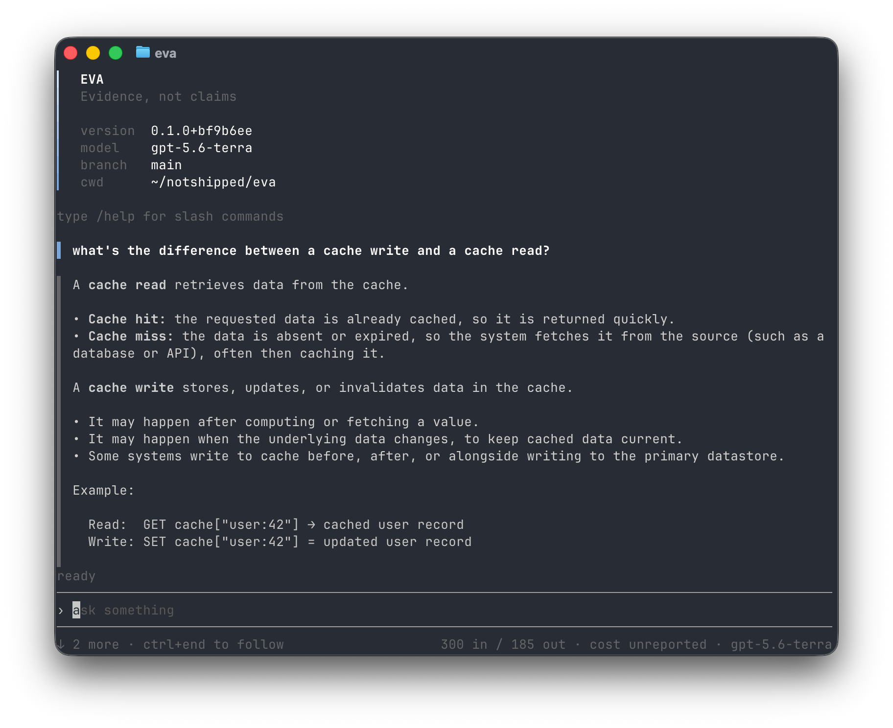

<p align="center">
  <picture>
    <source media="(prefers-color-scheme: dark)" srcset="docs/assets/eva-banner-dark.png">
    <source media="(prefers-color-scheme: light)" srcset="docs/assets/eva-banner-light.png">
    
  </picture>
</p>

<p align="center">An autonomous, multi-tenant, AI-native software factory.</p>

<p align="center">
  <a href="https://github.com/missingstudio/eva/actions/workflows/ci.yml"></a>
  <a href="https://github.com/missingstudio/eva/actions/workflows/security.yml"></a>
  <a href="https://github.com/missingstudio/eva/actions/workflows/audit.yml"></a>
  <a href="https://go.dev/"></a>
  <a href="LICENSE"></a>
</p>

<p align="center">
  
</p>

---

Most AI tools tell you what they did. Eva writes it down first. Every question, every
answer, every retry, and every token goes to a file on your disk as it happens. What
you see on screen is read back out of that file.

> [!NOTE]
> **Eva is early.** Today it is a terminal chat client on a carefully built foundation.
> It cannot read your files, run your tests, or touch your shell — there are no tools
> yet. [Where this goes next](docs/explanation/the-ladder.md).

### Install

```bash
# macOS and Linux
curl -fsSL https://raw.githubusercontent.com/missingstudio/eva/main/scripts/install.sh | sh

# With the Go toolchain
go install github.com/missingstudio/eva/cmd/eva@latest

# From source, with Go 1.26 or newer
git clone git@github.com:missingstudio/eva.git && cd eva && go build -o eva ./cmd/eva
```

The script checks the download against the release checksums before it installs
anything. Read [scripts/install.sh](scripts/install.sh) first if you prefer. Every
other path is in [how-to/install-eva.md](docs/how-to/install-eva.md).

### Connect a model

Eva talks to Anthropic and OpenAI. Anthropic is the default, so a key is the whole
setup:

```bash
export ANTHROPIC_API_KEY=sk-ant-...
eva
```

For OpenAI, run `eva init` and name the provider in `~/.eva/config.toml`. A ChatGPT or
Codex subscription works too: run `eva login`, then set `auth = "subscription"`.
`eva auth status` tells you which credential Eva will use. Your key never reaches a
settings file, a log, or the history file.

More in [connect a provider](docs/how-to/connect-a-provider.md) and
[use a subscription](docs/how-to/use-a-subscription.md).

### Use it

| Command               | What it does                       |
| --------------------- | ---------------------------------- |
| `eva`                 | Open the chat                      |
| `eva -p "<question>"` | Answer once, print to stdout, exit |
| `eva init`            | Write a starter settings file      |
| `eva login`           | Sign in to a subscription          |
| `eva auth status`     | Show how Eva will authenticate     |
| `eva help`            | Show this list                     |

In the chat, type `/` for the local commands: `/help`, `/cost`, `/clear`, `/model`.
They never reach a model, so they cost nothing. `eva -p` exits non-zero when the answer
fails, which makes it safe in a pipeline.
See [scripting](docs/how-to/script-with-eva.md).

### Settings

`eva init` writes `~/.eva/config.toml` with every option present, commented out, and
explained. Eva runs with none of it. A repo can carry `.eva/config.toml` to share a
team's colours and key bindings, and an allow-list stops it from changing anything
else. See [theme a repository](docs/how-to/theme-a-repository.md).

### Documentation

|                                                        |                                            |
| ------------------------------------------------------ | ------------------------------------------ |
| [tutorial/first-run.md](docs/tutorial/first-run.md)                   | Build it, ask one question, read it back      |
| [how-to/](docs/how-to/)                                               | One guide per task                            |
| [reference/commands.md](docs/reference/commands.md)                   | Every command, flag, slash command, and key   |
| [reference/configuration.md](docs/reference/configuration.md)         | Every setting, and what it defaults to        |
| [docs/Product.md](docs/Product.md)                                    | The map to every design document              |
| [docs/decisions.md](docs/decisions.md)                                | Every decision on one page                    |
| [CONTEXT.md](CONTEXT.md)                                              | The glossary. One concept, one name           |

### Contributing

```bash
make verify
```

That is exactly what CI checks on every change. `make help` lists every target.
Read [AGENTS.md](AGENTS.md) before you open a pull request.

---

MIT licensed. See [LICENSE](LICENSE).
