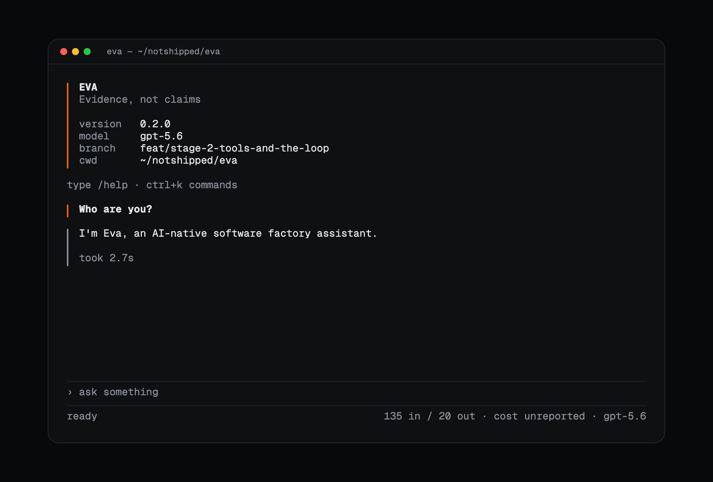

<p align="center">
  <picture>
    <source media="(prefers-color-scheme: dark)" srcset="assets/logo/eva-logo-white.svg">
    <source media="(prefers-color-scheme: light)" srcset="assets/logo/eva-logo-black.svg">
    
  </picture>
</p>

<p align="center">An AI-native software factory.</p>

<p align="center">
  <a href="https://github.com/missingstudio/eva/actions/workflows/ci.yml"></a>
  <a href="https://github.com/missingstudio/eva/actions/workflows/security.yml"></a>
  <a href="https://github.com/missingstudio/eva/actions/workflows/audit.yml"></a>
  <a href="https://bun.sh/"></a>
  <a href="LICENSE"></a>
</p>

<p align="center">
  
</p>

---

Eva is an open-source, AI-native software factory. It runs coding work end to
end — from a spec a machine can check, through a harness that does the work, to
evidence that it was done. Eva ships its own harness and drives the ones you
already pay for — Claude Code, Codex, OpenCode, DeepSeek Harness — behind one
contract, with one trace, one verifier, and one bill. It runs on your laptop as
a CLI and as a service you reach from anywhere; those are the same program.

> [!NOTE]
> **Eva is early.** Today it is a terminal client on a plugin kernel: a small
> core loads plugins, and every capability — the model, the surface, the trace,
> the themes — is one. Where this goes next is the
> [roadmap](docs/roadmap.md).

### Install

```bash
# Homebrew, on macOS
brew install --cask missingstudio/tap/eva

# The install script, on macOS and Linux
curl -fsSL https://raw.githubusercontent.com/missingstudio/eva/main/scripts/install.sh | sh

# npm — a prebuilt binary for your platform, no runtime needed
npm i -g @missingstudio/eva

# From source, with Bun 1.3 or newer
git clone git@github.com:missingstudio/eva.git && cd eva && bun install && bun run eva
```

The script checks the download against the release's signed checksums before it
installs anything, and says so either way. Read
[scripts/install.sh](scripts/install.sh) first if you prefer, or pass
`--require-signature` to make an unverifiable download a refusal. Every archive
also carries a provenance attestation:
`gh attestation verify <archive> --repo missingstudio/eva`.

### Connect a model

Eva talks to Anthropic, so a key is the whole setup:

```bash
export ANTHROPIC_API_KEY=sk-ant-...
eva
```

Your key never reaches a settings file, a log, or the session record.

### Use it

| Command             | What it does                                            |
| ------------------- | ------------------------------------------------------- |
| `eva`               | Open the interactive surface                            |
| `eva -p "<prompt>"` | Answer once, print to stdout, exit                      |
| `eva trust`         | Read this directory's `.eva`, and record the grant      |
| `eva untrust`       | Drop the grant for this directory                       |
| `eva config show`   | Print the resolved config, and where each key came from |
| `eva --version`     | What you have                                           |

In the chat, type `/` for the local commands: `/help`, `/model`, `/cost`, and
`/clear`. They never reach a model, so they cost nothing. `eva -p` exits
non-zero when the answer fails, which makes it safe in a pipeline.

The global flags are valid on every command: `--model provider/model` sets the
model for this run, `--config <path>` overlays a config file, and `--plugin` /
`--without-plugin` add or skip a plugin. The full surface, including how it is
parsed, is [reference/command-line.md](docs/reference/command-line.md).

### Settings

A repository can carry a `.eva` directory to share a team's setup. Eva reads it
only after you run `eva trust` there — the grant is yours to give, so it is a
verb you run rather than a file a repository can ship. `eva config show` names
every resolved key and where it came from.

### Documentation

|                                                                   |                                               |
| ----------------------------------------------------------------- | --------------------------------------------- |
| [docs/README.md](docs/README.md)                                  | The map — start here                          |
| [docs/context.md](docs/context.md)                                | The glossary. One concept, one name           |
| [reference/architecture.md](docs/reference/architecture.md)       | The plugin model, the kernel, every interface |
| [reference/writing-plugins.md](docs/reference/writing-plugins.md) | Author a plugin                               |
| [reference/command-line.md](docs/reference/command-line.md)       | Every command and flag                        |
| [reference/ci-cd.md](docs/reference/ci-cd.md)                     | How a change is checked and a release ships   |
| [docs/roadmap.md](docs/roadmap.md)                                | What we build, in what order                  |
| [docs/decisions.md](docs/decisions.md)                            | Every decision, and what it rejected          |

### Contributing

```bash
bun install && bun run verify
```

That is exactly what CI checks on every change. Read [AGENTS.md](AGENTS.md)
before you open a pull request.

---

MIT licensed. See [LICENSE](LICENSE).
