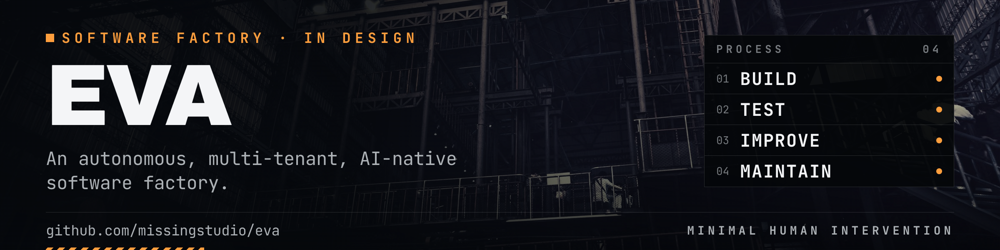

<p align="center">
  <picture>
    <source media="(prefers-color-scheme: dark)" srcset="docs/assets/eva-banner-dark.png">
    <source media="(prefers-color-scheme: light)" srcset="docs/assets/eva-banner-light.png">
    
  </picture>
</p>

# Eva

An autonomous, multi-tenant, AI-native software factory. It builds, tests, improves, and maintains software with minimal human intervention.

**Status:** stage 0 in progress. The spine runs: a prompt goes in, typed Events come out, and a Trace lands on disk. `eva` holds a conversation, a turn renders as styled markdown and reports what it cost, and the console answers commands of its own.

```
eva                                     # the console
eva -p "what is this project"           # one-shot: the answer, and what it cost
eva -p "what is this project" --json    # the same turn as typed Events
```

In the console, enter sends a prompt, ctrl+c interrupts the turn in flight and gives the prompt back, and ctrl+d leaves. An interrupted turn leaves a Session the next prompt can still use, and a Trace that says what happened.

A line that starts with a slash is a command the console answers itself — no Run opens and nothing reaches a Provider.

```
/help            list these commands
/cost            what the last turn cost, and the Session so far
/clear           empty the transcript
/model [name]    report which model answers, or switch to another
```

`/model` switches in the middle of a Session and leaves the transcript alone, so the next turn runs on the new model and is still answered in the light of the earlier ones. `/clear` empties the transcript by opening a new Session rather than by deleting messages from the one in hand — see [`0019`](docs/adr/0019-clearing-the-transcript-opens-a-new-session.md) — and the cumulative spend starts over with it. The Trace keeps everything either way.

Every turn is conditioned on a base system prompt before the transcript, and that prompt is [`core/prompt/base.md`](core/prompt/base.md) — compiled into the binary, reviewed as prose in a diff, and held to a 2 KiB budget that `make check` enforces. What each turn spends before its first word is therefore a figure the repository states, rather than one that grows a paragraph at a time. See [`0020`](docs/adr/0020-the-base-system-prompt-is-compiled-in-and-its-size-is-a-gate.md).

The style follows the terminal's background and the colour follows what the terminal can show — neither is configured. The machine-readable path builds no renderer at all, so what a script parses carries no terminal escapes.

Configuration is a file, not a pile of flags. `eva help` prints the command surface; `~/.eva/config.toml` holds the rest, and an API key is read from the environment and never from that file.

## Documents

- [docs/Product.md](docs/Product.md) — the plan: twenty stages, a failable exit test each. Draft.
- [CONTEXT.md](CONTEXT.md) — the glossary. One concept, one name.
- [docs/adr/](docs/adr/) — decisions and their reasons. `0001`–`0008` settle the stage 0 event schema; `0009` fixes config as TOML; `0010` fixes the module layout; `0011` makes the Recorder the only path to the Trace; `0015` keeps what a person watches apart from what is kept; `0017` makes the Outcome the only account of a turn; `0018` gives a Session its own Runs; `0019` empties a transcript by opening a new Session; `0020` compiles the base system prompt in and gates its size.
- [AGENTS.md](AGENTS.md) — how to work in this repo. `CLAUDE.md` points at it.